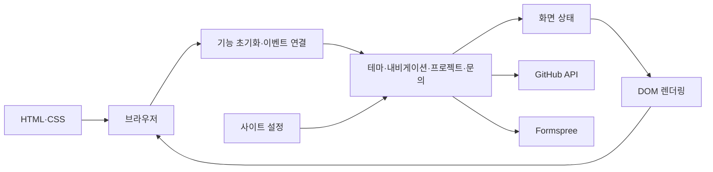

# 개발자 포트폴리오 사이트

## 프로젝트 소개

HTML, CSS, JavaScript로 만든 반응형 포트폴리오입니다. 브라우저 표준 모듈로 기능을 나누고 DOM 이벤트, 화면 상태, 비동기 요청을 연결하며 프로젝트 목록과 문의 폼을 제공합니다.

## 핵심 특징

- 모바일 내비게이션과 화면 크기에 따른 레이아웃
- 저장된 테마 설정을 복원하는 다크 모드
- GitHub 저장소 조회, 언어 필터, 로딩·빈 결과·오류 처리
- 문의 폼 입력 검증과 Formspree 전송
- 시맨틱 마크업, 접근성 속성, 스크롤 등장 효과

## 아키텍처

`사용자 이벤트 → 상태 갱신 → DOM 렌더링` 흐름으로 동작합니다. 외부 요청은 브라우저에서 GitHub와 Formspree로 전달됩니다.

| 경로 | 역할 |
| --- | --- |
| `index.html` | 페이지 구조와 접근성 속성 |
| `src/styles/main.css` | 반응형 스타일과 테마 변수 |
| `src/main.js` | 기능 초기화와 이벤트 연결 |
| `src/features/` | 테마·내비게이션·프로젝트·문의·효과 |
| `src/config.js`, `state.js`, `dom.js` | 설정·화면 상태·DOM 참조 |
| `tests/` | Node 테스트 러너로 DOM·요청·로컬 자산 검증 |
| `images/` | 화면에서 사용하는 이미지 |
| `screenshots/` | 최초 제출 버전의 화면 예시와 촬영 이력 |
| `scripts/check.py` | 문법·문서 링크 검사 |



## 실행 환경과 시작하기

실행에는 Python 3.10 이상만 필요합니다. JavaScript 문법 검사에는 Node.js 22를 사용합니다. 브라우저 실행에는 빌드가 필요하지 않습니다. Node.js 검사·테스트·형식 검사는 개발 도구를 설치한 뒤 실행합니다. 모든 명령은 저장소 루트에서 실행합니다.

```bash
make run
```

브라우저 주소는 `http://127.0.0.1:5500`입니다. Make가 없으면 `python3 -m http.server 5500 --bind 127.0.0.1`로 실행합니다.

## 외부 연동 설정

`src/config.js`의 `siteConfig`에 GitHub 사용자명, 저장소 조회 주소, Formspree 폼 주소가 있습니다. 실제 사용 전 자신의 연동 대상인지 확인합니다. 문의 폼 전송은 외부 서비스에 데이터를 보냅니다. GitHub API 제한이나 네트워크 장애가 발생하면 오류 안내와 재시도 버튼을 표시합니다.

## 검증

```bash
npm ci
make check
make test
make smoke
```

문서 링크와 JavaScript 문법을 검사하고, HTML이 참조하는 로컬 CSS·JavaScript·이미지 및 내부 앵커를 확인합니다. 외부 API 호출과 문의 전송은 자동 검사에 포함하지 않습니다. 브라우저에서 메뉴, 테마 복원, 언어 필터, 폼 오류 표시를 추가 확인합니다.

`make check`는 정적 분석·포맷·문서 검사를, `make test`는 `npm test`로 Node 내장 테스트 러너를 실행합니다. 테스트는 `tests/*.test.js`에 두며 실제 외부 요청을 모의합니다. jsdom이 실제 `index.html`을 읽어 메뉴·테마·필터 클릭, 카드의 텍스트 렌더링, 전송 중 잠금과 실패 후 재시도를 검증합니다. 브라우저 레이아웃·외부 서비스 상태는 자동 테스트로 보장하지 않습니다.
`make smoke`는 같은 러너로 로컬 자산·내부 이동 검사만 선택합니다(`npm run test:smoke`).

## 화면 예시

아래 이미지는 최초 제출 커밋 `f248fc2`에 추가된 과거 화면입니다. 영문 메뉴·테마 라벨을 사용하는 당시 버전으로, 현재 한국어 UI의 스크린샷은 아닙니다. [촬영 이력과 현재 화면 확인 절차](screenshots/README.md)를 참고합니다.

- [데스크톱 화면](screenshots/desktop.png)
- [모바일 화면](screenshots/mobile.png)
- [다크 모드 화면](screenshots/dark-mode.png)
